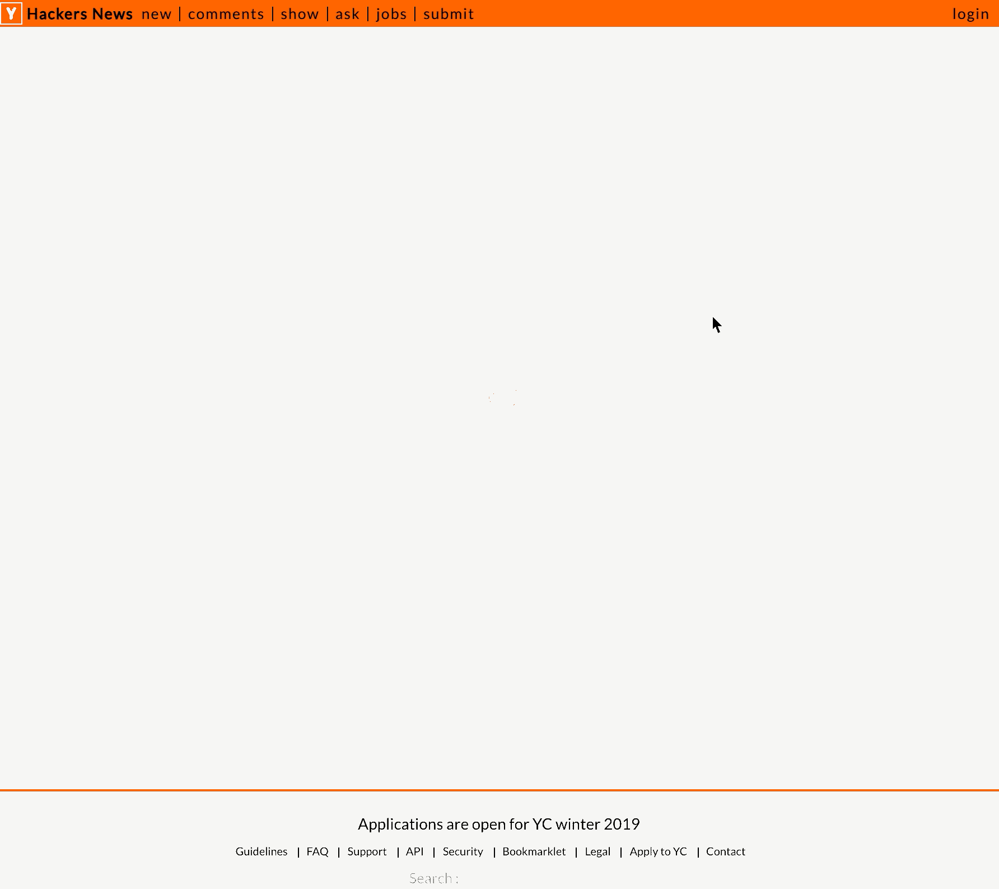

## Hacker News Clone
&nbsp;
<figure style='display:inline-block; width: 30%; text-align:center; margin:0 10px 0 0;'>
    
    <figurecaption>xhr with 'more' button</figurecaption>
</figure>
<figure style='display:inline-block; width: 30%; text-align:center; margin:0 10px 0 0;'>
    
    <figurecaption>fetch with 'opinted' buttons</figurecaption>
</figure>
<figure style='display:inline-block; width: 30%; text-align:center; margin:0 0 0 0;'>
    
    <figurecaption>axios with infinite scroll</figurecaption>
</figure>

### Introduction
A recreation of the Hacker News website 

### Features
- Hacker News list with top stories
- Three versions using different kinds of Ajax request.
&nbsp;(XHR, Fetch and Axios)
- Each version has different pagination features.
&nbsp;('more button', 'pointed button', 'infinite scroll')

### Built with
HTML5, CSS3, Javascript

### Bug / Feature request
If you find a bug, please kindly open an issue here with your expected result.

Should you have a request to add a new function, please feel free to ask me by opening an issue here.

### License
The MIT License (MIT)
